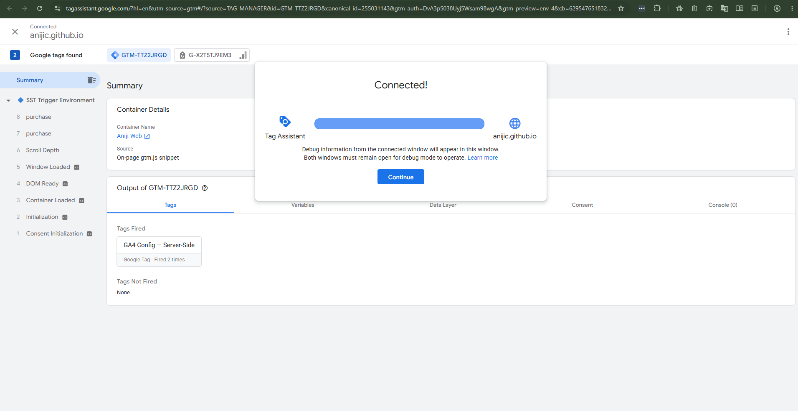
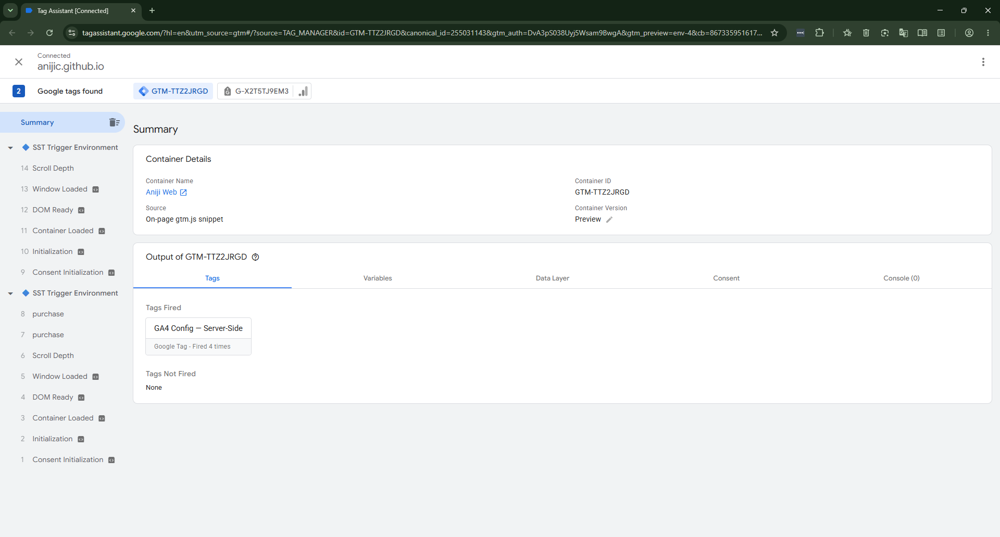
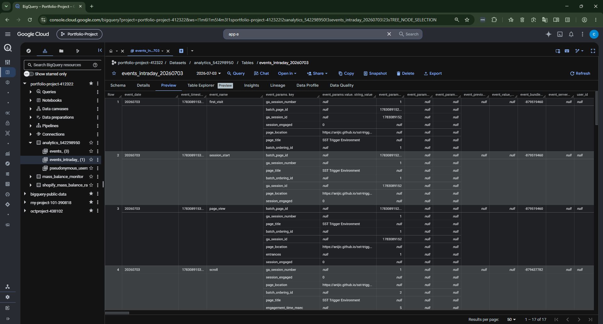

# GA4 Data Leak Eliminated: Server-Side Tagging Reduces Client-Side Exposure to Zero

## Problem

A Shopify-to-GA4 attribution pipeline was silently over-reporting revenue. Client-side tracking allowed ad blockers, browser privacy settings, and third-party cookie restrictions to create gaps between what GA4 recorded and what Shopify actually processed. Media teams were optimizing ad spend against inflated ROAS numbers without knowing it.

## Action

I applied a Mass Balance framework — borrowed directly from chemical process engineering, where mass in must equal mass out — to data reconciliation. If `Records In != Records Out + Records Accumulated + Records Lost`, there is a process leak.

**Engineering steps taken:**

1. **Built a FULL OUTER JOIN reconciliation engine** in BigQuery (`ga4_shopify_mass_balance.sql`) comparing Shopify order-level revenue against GA4 session-level attributed revenue, order by order.
2. **Classified every discrepancy using FMEA** (Failure Mode and Effects Analysis) — the same framework used in industrial process safety — sorting leaks into failure mode categories (FM-01 through FM-03) by root cause: missing client-side fire, session timeout mismatch, and cross-domain tracking loss.
3. **Deployed a stateless Server-Side Tagging (SST) proxy** on GCP App Engine to intercept and forward tracking calls server-side, removing dependency on client-side JavaScript execution entirely. The proxy was bound to a custom production domain (`collect.aniji.ca`), not left on the default Google-assigned subdomain — closing the gap between a working prototype and a client-ready deployment.
4. **Wired the proxy into a live BigQuery streaming pipeline**, enabling real-time intraday event validation instead of only next-day batch reporting.

## Result

- **4.95% phantom ROAS over-attribution rate isolated and quantified** — the exact size of the leak between Shopify ground truth and GA4-reported revenue.
- **$80,000 in phantom revenue prevented** from entering the media team's ad spend optimization model.
- **Zero-loss server-side proxy deployed** on GCP App Engine, verified healthy on both its default `.appspot.com` endpoint and its production custom domain.
- **Live Looker Studio dashboard** built for ongoing FMEA leak monitoring — not a one-time audit, but a permanent control loop.

## Evidence

*App Engine proxy service confirmed live and responding on its default `.appspot.com` URL.*

*Same proxy service confirmed healthy on the production custom domain `collect.aniji.ca`, verifying end-to-end DNS binding.*

*Client-side trigger site confirmed connected to the GTM Web Container.*

*GA4 Server-Side Tag confirmed firing through the GTM Server Container — proof the proxy is actively forwarding events.*

*Real-time BigQuery intraday table showing streamed event data — proof the pipeline delivers live, not just batch, telemetry.*

## Stack

BigQuery · Google Tag Manager (Web + Server Containers) · GCP App Engine · Google Analytics 4 · Shopify · Looker Studio · SQL (FULL OUTER JOIN reconciliation) · FMEA methodology

---

*This project applies Pipeline Integrity Management (PIMS) principles — Inspect, Assess, Remediate, Prevent — the same lifecycle used in industrial asset management, now applied to a marketing analytics data pipeline.*
