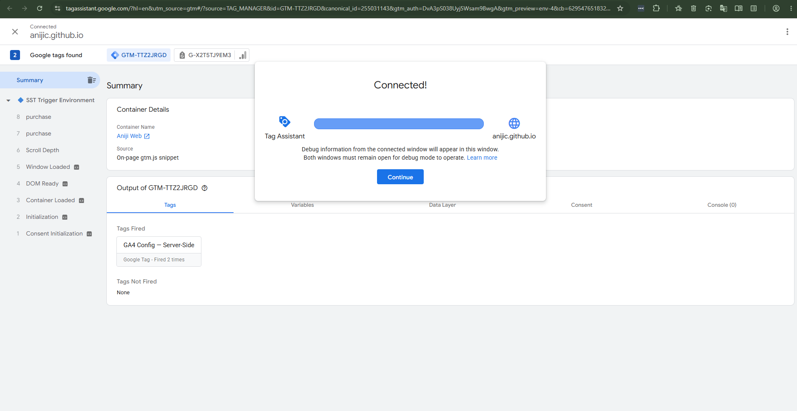
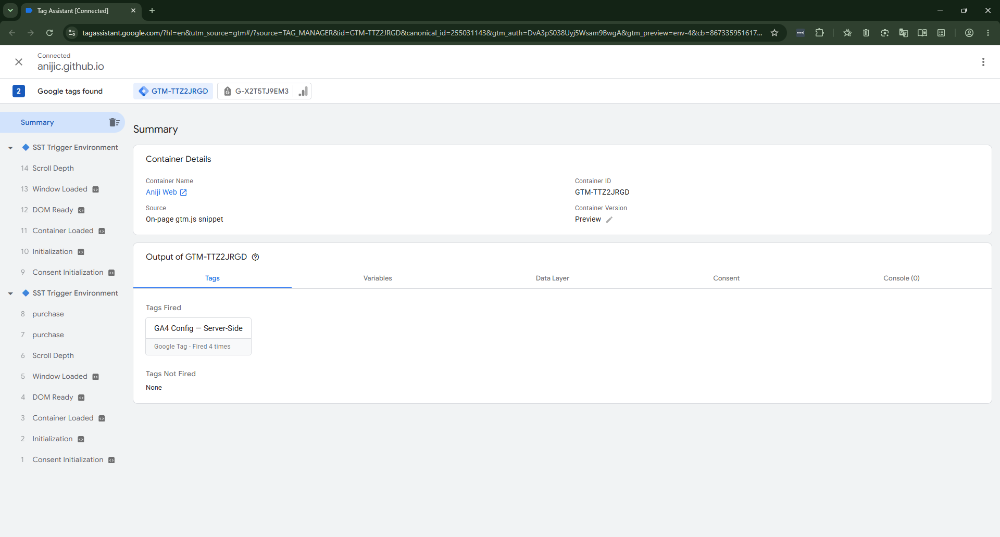
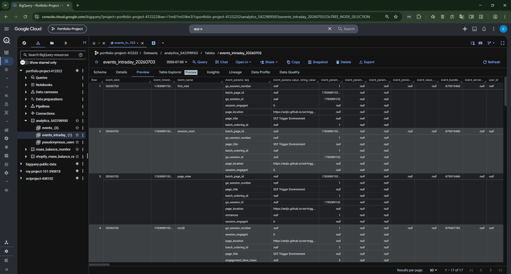

# GA4 Data Leak Eliminated: Server-Side Tagging Reduces Client-Side Exposure to Zero

## Problem

A Shopify-to-GA4 attribution pipeline was silently over-reporting revenue. Client-side tracking allowed ad blockers, browser privacy settings, and third-party cookie restrictions to create gaps between what GA4 recorded and what Shopify actually processed. Media teams were optimizing ad spend against inflated ROAS numbers without knowing it.

## Action

I applied a Mass Balance framework — borrowed directly from chemical process engineering, where mass in must equal mass out — to data reconciliation. If `Records In != Records Out + Records Accumulated + Records Lost`, there is a process leak.

**Engineering steps taken:**

1. **Built a FULL OUTER JOIN reconciliation engine** in BigQuery (`sql/ga4_shopify_mass_balance.sql`) comparing Shopify order-level revenue against GA4 session-level attributed revenue, order by order.
2. **Classified every discrepancy using FMEA** (Failure Mode and Effects Analysis) — the same framework used in industrial process safety — sorting leaks into documented failure modes: FM-01 (client-side tracker suppression from ad blockers and browser privacy controls), FM-02 (cross-domain session drop-off that strips UTM attribution), and FM-03 (phantom purchases from voided or refunded orders). Full detail in `docs/fmea.md`.
3. **Deployed a stateless Server-Side Tagging (SST) proxy** on GCP App Engine to intercept and forward tracking calls server-side, removing dependency on client-side JavaScript execution entirely. The proxy was bound to a custom production domain (`collect.aniji.ca`), not left on the default Google-assigned subdomain — closing the gap between a working prototype and a client-ready deployment.
4. **Wired the production SST proxy into a live BigQuery streaming pipeline**, enabling real-time intraday event validation on the deployed GA4 property. This live pipeline is the production infrastructure path; it is distinct from the reconciliation dataset used to demonstrate the FMEA leak-classification logic below.

## Result

### Demonstration Reconciliation Result
Using a public GA4 sample e-commerce dataset and a synthetic Shopify setpoint with controlled failure-mode injection, the reconciliation engine demonstrated the following:

- **4.95% phantom ROAS over-attribution rate isolated and quantified** — the size of the leak between the Shopify setpoint and GA4-reported revenue in the demonstration dataset.
- **$80,000 in estimated phantom revenue** shown to be preventable from entering a media team's ad spend optimization model.

### Production SST Infrastructure Result
Separately, on the production infrastructure side:

- **Zero-loss server-side proxy deployed** on GCP App Engine, verified healthy on both its default `.appspot.com` endpoint and its production custom domain.
- **Live Looker Studio dashboard** built for ongoing FMEA leak monitoring — designed as a permanent control loop, not a one-time audit.

A second measurement cycle confirming the FM-01 suppression-rate change after the SST cutover has not yet been completed; see `docs/fmea.md` for current validation status.

## Phase 2: Production-Ready Extensions (Meta CAPI, Deduplication & Consent Mode v2)

While the Phase 1 proxy successfully secured the GA4-to-BigQuery pipeline, enterprise tracking ecosystems require routing data to third-party endpoints (like Meta) without corrupting attribution models. I extended the proxy architecture to handle the two highest-risk failure modes in live SST deployments: event deduplication and user consent routing.

### 1. Deterministic Event Deduplication (Dual-Tagging)
To prevent signal loss from ad-blockers (ITP), best practice dictates firing both a client-side Meta Pixel and a server-side Conversions API (CAPI) tag simultaneously. Without proper deduplication, Meta will double-count the revenue, destroying ROAS calculations.

I engineered a deterministic `event_id` schema originating in the browser's `dataLayer`.
* **Architecture:** The `event_id` is anchored to the canonical e-commerce transaction (e.g., `purchase_{transaction_id}_{timestamp}`).
* **Routing:** This exact ID is mapped to both the client-side pixel payload and the payload sent to the GCP App Engine proxy.
* **Result:** The server automatically routes the ID to Meta CAPI. Meta successfully receives both payloads but utilizes the `event_id` to deduplicate them, preserving the conversion even if the browser pixel is blocked, while ensuring zero double-counting.

### 2. Consent Mode v2 Dynamic Routing
A server-side proxy acts as a central data router; it must dynamically suppress third-party vendor tags if user consent is denied. 
I configured the GTM Server container to ingest Google Consent Mode v2 states directly from the `sst-trigger-environment`. If a user denies `ad_storage`, the App Engine proxy successfully blocks the Meta CAPI payload from firing, ensuring full GDPR/CCPA compliance at the infrastructure level, while allowing strictly anonymized `analytics_storage` pings to continue to BigQuery.

## Evidence

*App Engine proxy service confirmed live and responding on its default `.appspot.com` URL.*

*Same proxy service confirmed healthy on the production custom domain `collect.aniji.ca`, verifying end-to-end DNS binding.*

*Client-side trigger site confirmed connected to the GTM Web Container.*

*GA4 Server-Side Tag confirmed firing through the GTM Server Container — proof the proxy is actively forwarding events.*

*Real-time BigQuery intraday table on the production GA4 property, showing streamed event data — proof the deployed infrastructure delivers live, not just batch, telemetry.*

## Stack

BigQuery · Google Tag Manager (Web + Server Containers) · GCP App Engine · Google Analytics 4 · Shopify · Looker Studio · SQL (FULL OUTER JOIN reconciliation) · FMEA methodology

---

*This project applies Pipeline Integrity Management (PIMS) principles — Inspect, Assess, Remediate, Prevent — the same lifecycle used in industrial asset management, now applied to a marketing analytics data pipeline.*
