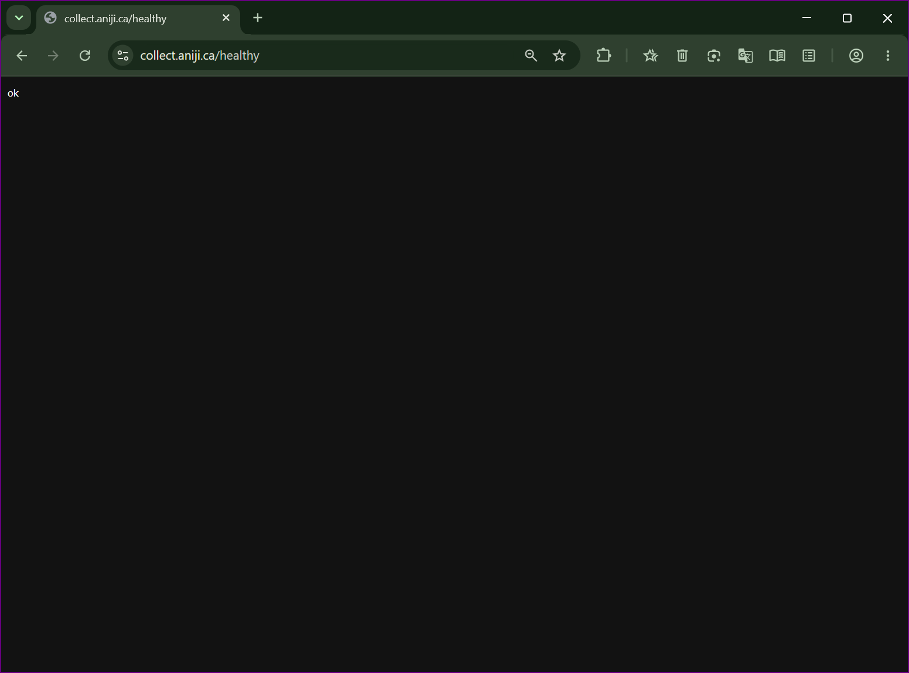
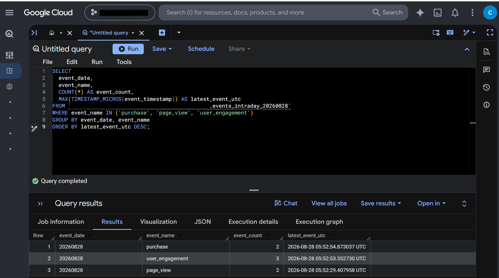
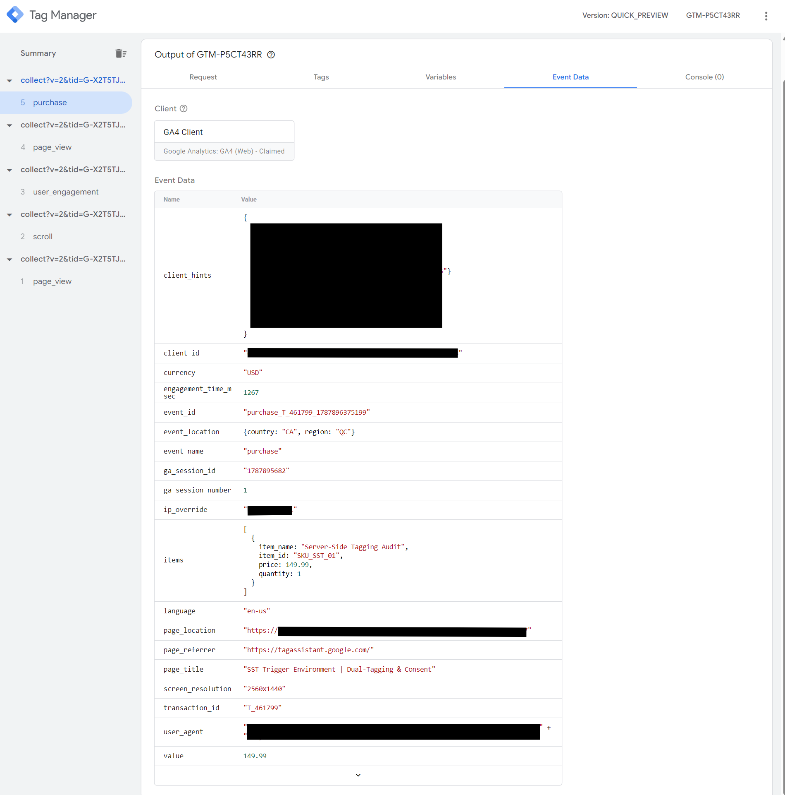
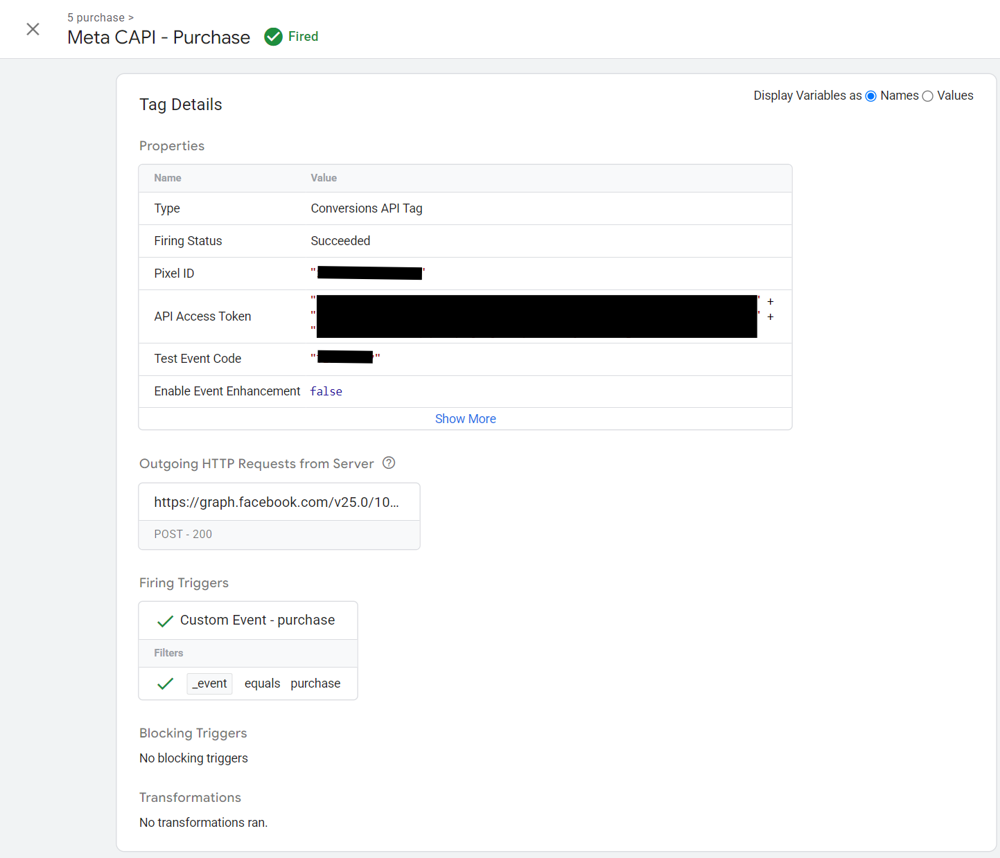
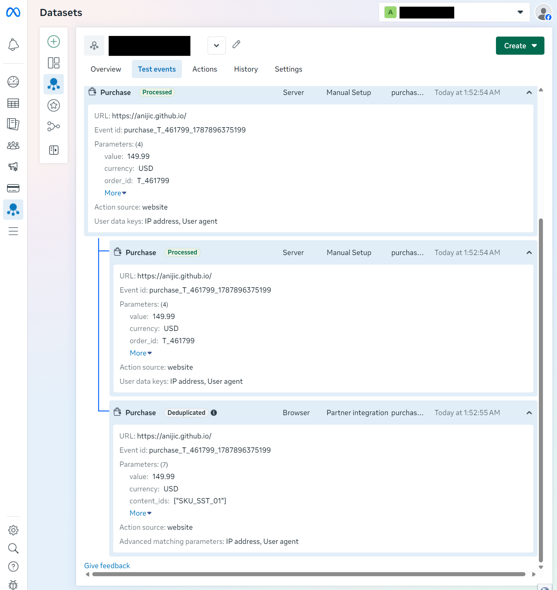

# Hardened a GA4 Tracking Pipeline with First-Party SST, BigQuery Validation, and Meta CAPI Deduplication

## Problem

A Shopify-to-GA4 attribution pipeline was silently over-reporting revenue. Client-side tracking allowed ad blockers, browser privacy settings, and third-party cookie restrictions to create gaps between what GA4 recorded and what Shopify actually processed. Media teams were optimizing ad spend against inflated ROAS numbers without knowing it.

## Action

I applied a Mass Balance framework — borrowed directly from chemical process engineering, where mass in must equal mass out — to data reconciliation. If `Records In != Records Out + Records Accumulated + Records Lost`, there is a process leak.

**Engineering steps taken:**

1. **Built a FULL OUTER JOIN reconciliation engine** in BigQuery (`sql/ga4_shopify_mass_balance.sql`) comparing Shopify order-level revenue against GA4 session-level attributed revenue, order by order.
2. **Classified every discrepancy using FMEA** (Failure Mode and Effects Analysis) — the same framework used in industrial process safety — sorting leaks into documented failure modes: FM-01 (client-side tracker suppression from ad blockers and browser privacy controls), FM-02 (cross-domain session drop-off that strips UTM attribution), and FM-03 (phantom purchases from voided or refunded orders). Full detail in `docs/fmea.md`.
3. **Deployed a stateless Server-Side Tagging (SST) proxy** on GCP App Engine to receive and forward measurement traffic server-side, reducing reliance on direct browser-to-vendor delivery. The proxy was bound to a custom first-party domain (`collect.aniji.ca`) rather than left on the default Google-assigned subdomain.
4. **Connected the deployed SST proxy to a GA4-to-BigQuery streaming path**, enabling intraday event-arrival validation on an owned GA4 property. This live infrastructure path is distinct from the public GA4 sample dataset and synthetic Shopify setpoint used to demonstrate the FMEA reconciliation logic below.

## Result

### Demonstration Reconciliation Result

Using a public GA4 sample e-commerce dataset and a synthetic Shopify setpoint with controlled failure-mode injection, the reconciliation engine demonstrated the following:

- **4.95% phantom ROAS over-attribution rate isolated and quantified** — the size of the leak between the Shopify setpoint and GA4-reported revenue in the demonstration dataset.
- **Approximately $80,000 in modeled phantom revenue exposure** quantified in the demonstration dataset—revenue that would otherwise distort a media optimization model if treated as valid conversion data.

### Deployed SST Infrastructure Result

Separately, on the deployed infrastructure side:

- **First-party SST proxy deployed** on GCP App Engine and verified healthy on its custom first-party domain.
- **Live Looker Studio monitoring dashboard** built for ongoing FMEA-based leak monitoring, designed as a control loop rather than a one-time audit.

A second measurement cycle confirming the FM-01 suppression-rate change after the SST cutover has not yet been completed; see `docs/fmea.md` for current validation status.

## Phase 2: Production-Ready Extensions (Meta CAPI, Deduplication & Consent Mode v2)

While the Phase 1 proxy successfully secured the GA4-to-BigQuery pipeline, enterprise tracking ecosystems require routing data to third-party endpoints (like Meta) without corrupting attribution models. I extended the proxy architecture to address two high-risk concerns in SST deployments: event deduplication and consent-aware routing.

### 1. Deterministic Event Deduplication (Dual-Tagging)

To reduce signal loss from ad blockers and browser privacy controls, the implementation sends Purchase signals through both a client-side Meta Pixel and a server-side Conversions API (CAPI) tag. Without a shared `event_id` and correct deduplication configuration, browser and server Purchase signals can be counted separately, inflating conversion and ROAS reporting.

I engineered a deterministic `event_id` schema originating in the browser's `dataLayer`.

- **Architecture:** The `event_id` is anchored to the canonical e-commerce transaction (e.g., `purchase_{transaction_id}_{timestamp}`).
- **Routing:** This exact ID is mapped to both the client-side pixel payload and the payload sent to the GCP App Engine proxy.
- **Result:** The server routes the ID to Meta CAPI. Meta receives both payloads and uses the shared `event_id` to deduplicate them, preserving the conversion if the browser pixel is unavailable while avoiding double counting.

### 2. Consent-Aware Routing Design

A server-side proxy acts as a central data router and should evaluate third-party vendor delivery against the user’s consent state.

The architecture is designed to ingest Google Consent Mode v2 signals from the `sst-trigger-environment` and use those signals as routing controls for downstream vendor tags. In a production implementation, a consent-denied validation case should confirm that a Meta CAPI payload is blocked when the relevant advertising consent is denied, while consent-safe analytics behavior follows the configured policy.

## Evidence

*App Engine proxy service confirmed healthy on the custom first-party domain `collect.aniji.ca`, validating end-to-end DNS binding for the collection endpoint.*

*GA4 intraday table on the owned BigQuery property, confirming that the deployed pipeline delivers streaming event telemetry rather than relying solely on batch exports.*

*GTM Server Container Event Data confirms that the inbound Purchase payload retained its deterministic `event_id`, transaction ID, value, currency, and item data after browser-to-server routing. Client, network, and preview-session identifiers are redacted.*

*GTM Server Preview shows the Meta CAPI Purchase tag firing successfully. Meta’s Graph API returned HTTP `200`, confirming accepted server-side event delivery. Credentials and test identifiers are redacted.*

*Meta Events Manager shows the server Purchase as `Processed` and the matching browser Purchase as `Deduplicated` using the shared event identity, so the tested conversion is not counted twice.*

## Stack

BigQuery · Google Tag Manager (Web + Server Containers) · GCP App Engine · Google Analytics 4 · Shopify · Looker Studio · SQL (FULL OUTER JOIN reconciliation) · FMEA methodology

---

*This project applies Pipeline Integrity Management (PIMS) principles — Inspect, Assess, Remediate, Prevent — the same lifecycle used in industrial asset management, now applied to a marketing analytics data pipeline.*
