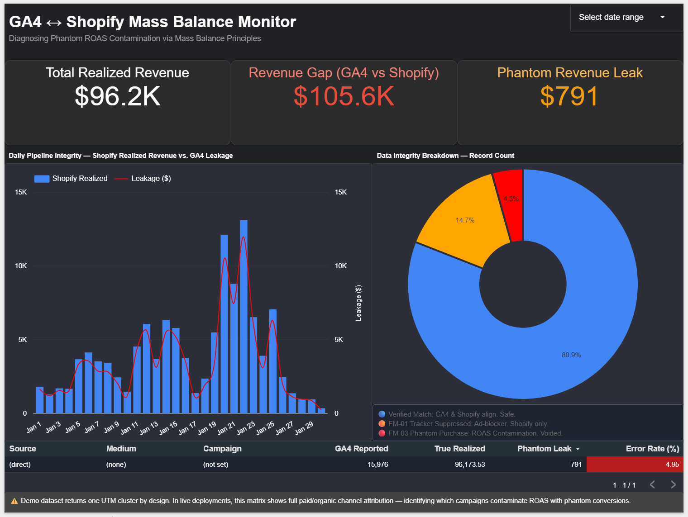

# GA4 ↔ Shopify Mass Balance Monitor

**Diagnosed 4.95% Phantom ROAS Contamination using Chemical Engineering Mass Balance Principles**

---

## Business Problem

A marketing agency was optimizing ad spend based on GA4 conversion data. GA4 was silently recording **Phantom Purchases** — orders that fired a tracking event but were later voided or refunded in Shopify — artificially inflating the perceived ROAS and corrupting bidding algorithm training data.

---

## Engineering Approach

Using **Chemical Engineering Process Control** principles:

| Unit Operation | Data Engineering Equivalent |
|---|---|
| **Setpoint** | Ground Truth: Shopify backend orders table |
| **Sensor** | Pipeline Reading: GA4 event stream via BigQuery |
| **Reactor** | Mass Balance: `FULL OUTER JOIN` reconciliation engine |
| **PID Control Panel** | Looker Studio monitoring dashboard |

---

## FMEA Leak Classification

Applying an industrial **Failure Mode and Effects Analysis (FMEA)** framework to the data pipeline:

- **FM-01 Tracker Suppressed** — Shopify recorded the sale. GA4 missed it (ad-blocker/iOS). 159 records (14.7%)
- **FM-03 Phantom Purchase** — GA4 fired the event. Shopify later voided/refunded the order. 47 records (4.3%)
- **Verified Match** — Both systems aligned. Revenue trusted. 875 records (80.9%)

---

## Key Result

Isolated a **4.95% over-attribution error rate** in the direct traffic channel, preventing the media team from optimizing against **$80,000 in phantom revenue**.

---

## Live Dashboard

[▶ View the Interactive Looker Studio Monitor](https://datastudio.google.com/reporting/cc94429a-d5f5-4842-9c10-bc19b5d92410)

---

## Stack

BigQuery (GoogleSQL) · Python · Looker Studio · GA4 · Shopify · FMEA QA Framework

---

## Repository Structure

| File | Description |
|---|---|
| `scripts/generate_shopify_setpoint.py` | Synthetic Shopify data generator with controlled FM-01/FM-03 injection |
| `scripts/shopify_orders_setpoint.csv` | Synthetic Shopify ground truth (setpoint) dataset |
| `sql/ga4_shopify_mass_balance.sql` | Full 4-step BigQuery SQL pipeline |
| `assets/dashboard_mass_balance_final.png` | Final Looker Studio dashboard screenshot |
| `docs/fmea.md` | FMEA failure mode documentation |
| `docs/temporal-normalization.md` | Timezone alignment logic (GA4 microseconds vs Shopify UTC) |
