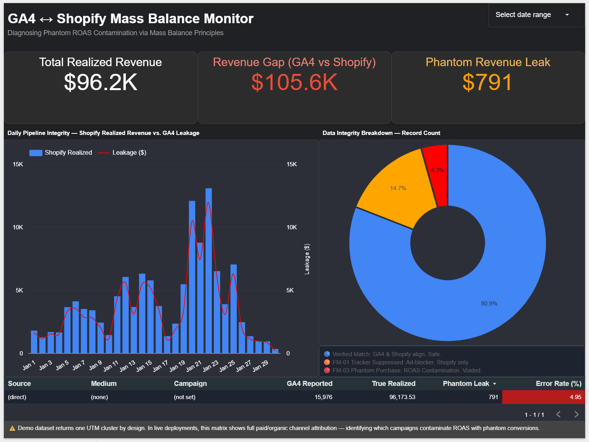

# GA4 ↔ Shopify Mass Balance Monitor & First-Party SST Proxy

**Diagnosed 4.95% Phantom ROAS Contamination using Chemical Engineering Mass Balance Principles & Server-Side Tagging (SST)**

---

## The Business Problem

E-commerce marketing teams optimize their ad spend based on GA4 conversion data. However, client-side tracking pipelines silently hemorrhage data through two critical failure modes:

1. **Client-Side Signal Loss (FM-01):** Ad-blockers and Safari's Intelligent Tracking Prevention (ITP) suppress valid purchase events from ever reaching GA4.
2. **Phantom Purchases (FM-03):** Orders that fire a tracking event but are later voided or refunded in Shopify remain in GA4, artificially inflating perceived ROAS and corrupting bidding algorithm training data.

---

## The Engineering Approach

Using **Chemical Engineering Process Control** principles, I built a zero-loss data pipeline that treats data flow with the same rigor as physical mass balance:

| Unit Operation | Data Engineering Equivalent |
|---|---|
| **First-Party Sensor** | Server-Side Tagging (SST) Proxy deployed on GCP App Engine to bypass ad-blockers |
| **Setpoint** | Ground Truth: Shopify backend orders table |
| **Reactor** | Mass Balance: `FULL OUTER JOIN` reconciliation engine in BigQuery |
| **PID Control Panel** | Looker Studio monitoring dashboard |

**System Architecture:** [View the SST Proxy & Reconciliation Engine Diagram](architecture/sst-mass-balance-engineering-view.md)

---

## FMEA Leak Classification

Applying an industrial **Failure Mode and Effects Analysis (FMEA)** framework to the data pipeline, I isolated the exact mechanical breakdowns:

- **FM-01 Tracker Suppressed (Root cause addressed by SST architecture)** — Shopify recorded the sale. GA4 missed it due to client-side suppression. **159 records (14.7%)**
- **FM-03 Phantom Purchase** — GA4 fired the event. Shopify later voided/refunded the order. **47 records (4.3%)**
- **Verified Match** — Both systems aligned. Revenue trusted. **875 records (80.9%)**

---

## Key Result

Using a public e-commerce sample dataset and a synthetic Shopify setpoint, the mass balance reconciliation engine isolated a **4.95% over-attribution error rate**, demonstrating how to prevent an estimated **$80,000 in phantom revenue** from polluting media optimization models.

---

## Live Dashboard

[▶ View the Interactive Looker Studio Monitor](https://datastudio.google.com/reporting/cc94429a-d5f5-4842-9c10-bc19b5d92410)

---

## Technical Stack & Enterprise Infrastructure

* **Production Ingestion:** First-Party Server-Side Tagging (SST) Proxy deployed on GCP App Engine Standard (`nodejs20`, Scale-to-Zero), mapped to custom domain `collect.aniji.ca` to establish first-party context.
* **Reconciliation Engine (Demo Data):** The metrics shown below are demonstrated on the public GA4 sample e-commerce dataset using the **January 2021 historical sample window**, plus a synthetic Shopify order generator with controlled failure-mode injection. This historical demonstration path is separate from the live GA4 intraday export used to validate the production SST infrastructure. The same reconciliation schema and SQL pattern can be applied to a client's live BigQuery export. See [`docs/server-side-migration-framework.md`](docs/server-side-migration-framework.md) for the production cutover path.
* **Data Warehousing:** BigQuery (GoogleSQL) with cross-project IAM separation between the SST proxy project and warehouse project.
* **Reconciliation:** Python · SQL · FMEA QA Framework
* **Visualization:** Looker Studio

---

## Repository Structure

| Directory / File | Description |
|---|---|
| `architecture/` | Mermaid.js system architecture and pipeline diagrams |
| `config/` | App Engine `app.yaml` and GTM Web/Server JSON container exports |
| `scripts/generate_shopify_setpoint.py` | Synthetic Shopify data generator with controlled FM-01/FM-03 injection |
| `scripts/shopify_orders_setpoint.csv` | Synthetic Shopify ground truth (setpoint) dataset |
| `sql/ga4_shopify_mass_balance.sql` | Full 4-step BigQuery SQL reconciliation pipeline |
| `docs/server-side-migration-framework.md` | SST cutover strategy and cross-project IAM documentation |
| `docs/fmea.md` | FMEA failure mode technical documentation |
| `docs/temporal-normalization.md` | Timezone alignment logic (GA4 microseconds vs Shopify UTC) |

---

**Related repository:** [`ga4-data-integrity-audit`](https://github.com/anijic/ga4-data-integrity-audit) — GA4 tracking audit deliverables, 47-point diagnostic matrix, dev-ready fix tickets.
