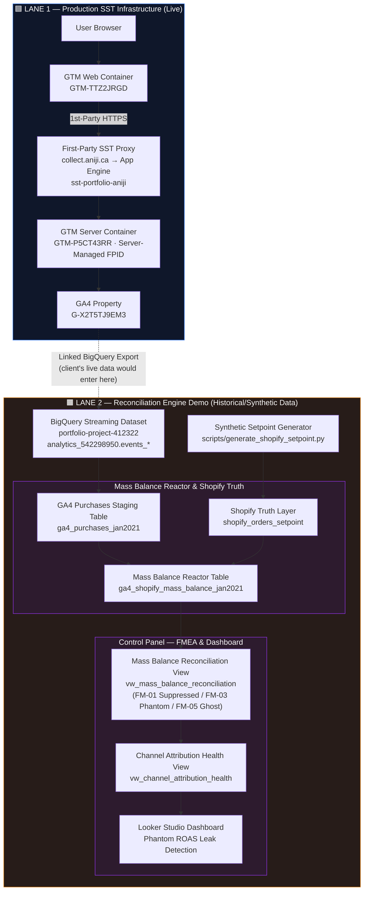

# SST + Mass Balance – Engineering View

```mermaid
flowchart TD

    subgraph LANE1["🟦 LANE 1 — Production SST Infrastructure (Live)"]
        direction TB
        A1["User Browser"] --> A2["GTM Web Container<br/>GTM-TTZ2JRGD"]
        A2 -->|"1st-Party HTTPS"| A3["First-Party SST Proxy<br/>collect.aniji.ca → App Engine<br/>sst-portfolio-aniji"]
        A3 --> A4["GTM Server Container<br/>GTM-P5CT43RR · Server-Managed FPID"]
        A4 --> A5["GA4 Property<br/>G-X2T5TJ9EM3"]
    end

    A5 -.->|"Linked BigQuery Export<br/>(client's live data would enter here)"| B1

    subgraph LANE2["🟧 LANE 2 — Reconciliation Engine Demo (Historical/Synthetic Data)"]
        direction TB
        B1["BigQuery Streaming Dataset<br/>portfolio-project-412322<br/>analytics_542298950.events_*"]
        B1 --> B2["GA4 Purchases Staging Table<br/>ga4_purchases_jan2021"]

        B3["Synthetic Setpoint Generator<br/>scripts/generate_shopify_setpoint.py"] --> B4

        subgraph REACTOR["Mass Balance Reactor & Shopify Truth"]
            B4["Shopify Truth Layer<br/>shopify_orders_setpoint"]
            B2 --> B5["Mass Balance Reactor Table<br/>ga4_shopify_mass_balance_jan2021"]
            B4 --> B5
        end

        subgraph CONTROL["Control Panel — FMEA & Dashboard"]
            B5 --> C1["Mass Balance Reconciliation View<br/>vw_mass_balance_reconciliation<br/>(FM-01 Suppressed / FM-03 Phantom / FM-05 Ghost)"]
            C1 --> C2["Channel Attribution Health View<br/>vw_channel_attribution_health"]
            C2 --> C3["Looker Studio Dashboard<br/>Phantom ROAS Leak Detection"]
        end
    end

    style LANE1 fill:#0f172a,stroke:#3b82f6,color:#fff
    style LANE2 fill:#271c19,stroke:#d97706,color:#fff
    style REACTOR fill:#2d1b2e,stroke:#9333ea,color:#fff
    style CONTROL fill:#2d1b2e,stroke:#9333ea,color:#fff
```
