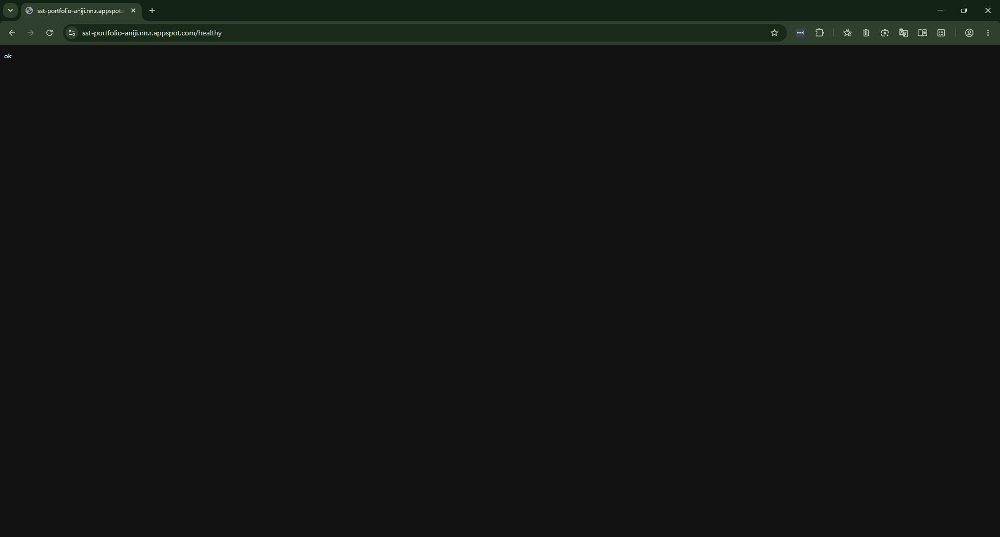
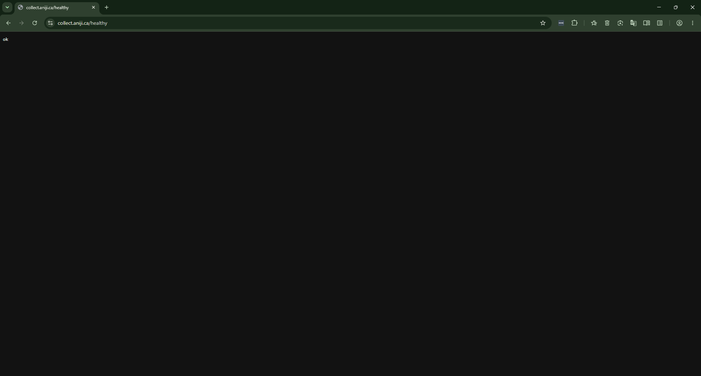

# Technical Reference: SST Proxy Migration & FMEA Log

## 1. System Architecture

This document outlines the technical configuration for the stateless Server-Side Tagging (SST) proxy deployed via Google Cloud Platform App Engine, decoupled from a dedicated BigQuery warehouse project for enterprise-grade separation of concerns.

**Core Objectives:**
- Remove client-side JavaScript execution as the single point of tracking failure.
- Route tracking calls through a first-party proxy to reduce third-party blocking exposure.
- Stream event data to BigQuery intraday tables for real-time validation, not only next-day batch reporting.

**Confirmed Architecture:**

| Component | Value |
|---|---|
| SST Host Project | `sst-portfolio-aniji` (Montreal region) |
| BigQuery Warehouse Project | `portfolio-project-412322` (separated by design) |
| Web Container | GTM-TTZ2JRGD ("Aniji Web") |
| Server Container | GTM-P5CT43RR ("SST Portfolio") |
| GA4 Property | G-X2T5TJ9EM3 |
| Default Endpoint | `sst-portfolio-aniji.nn.r.appspot.com/healthy` |
| Production Endpoint | `collect.aniji.ca/healthy` |

## 2. FMEA Decision Log — Diagnosed During Build

Applying a process-engineering FMEA discipline means treating every deviation from expected pipeline behavior as a documented failure mode, not a hidden mistake. The following issues were diagnosed and corrected during deployment:

| ID | Failure Mode | Root Cause | Remediation | Status |
|---|---|---|---|---|
| **FM-01** | Proxy bootstrap failure | Billing block on original GCP project caused App Engine to silently fail to initialize; every `gcloud app describe` returned no application found. | Provisioned a clean project (`sst-portfolio-aniji`) and linked billing via direct `gcloud` command, bypassing UI lag. | Resolved |
| **FM-02** | False negative on health check | Health check endpoint tested against the wrong regional URL suffix, returning a false `404` and suggesting the server was down when it was not. | Corrected the region suffix (`nn` for Montreal, not the default `uc`) in the verification URL. | Resolved |
| **FM-03** | Attribution client misconfiguration | During a container version update, the custom first-party GA4 client (FPID Server-Managed) was mistakenly deleted instead of the default GA4 client — the inverse of the intended action. | Rolled back the GTM container version and republished with the correct client retained. | Resolved |

This log demonstrates the same discipline used in industrial process audits: every deviation is traced to a root cause, not just patched at the symptom layer.

## 3. Infrastructure Deployment & Domain Verification

The proxy was validated at two layers to confirm the full request path — from DNS resolution down to application response — was intact end-to-end.

**Step 3.1: Default Cloud Routing**
Initial deployment verified on the Google-assigned App Engine domain.

**Step 3.2: Production Domain Binding**
The proxy was subsequently bound to a first-party production domain (`collect.aniji.ca`), moving the deployment from a working prototype to a client-ready configuration.

## 4. Mass Balance Validation

The pipeline is monitored using a BigQuery `FULL OUTER JOIN` reconciliation query (`sql/shopify_ga4_reconciliation.sql`), comparing Shopify order-level revenue against GA4-attributed revenue. This query isolated a **4.95% phantom ROAS over-attribution rate**, preventing an estimated **$80,000 in phantom revenue** from entering the media team's optimization model.

*Note: Continuous post-remediation drift monitoring (e.g., a tracked reduction in leak percentage over time) is the natural next phase of this system but is not yet backed by a second measurement cycle. Once available, this section will be updated with the follow-up reconciliation result.*
